# Offline Tablet POC Architecture and Action Plan

## Metadata

- Created: 2026-09-29
- Last updated: 2026-09-29
- Author/role: Codex, senior software architect and coordinator
- File: `docs/2026-09-29-poc-architecture-action-plan.md`
- Branch reviewed: `development-alt`
- Scope: first-party Android app, pack builder, project plans, README, and the two 2026-09-29 specialist reviews
- Excluded: `android/third_party/**` source; `llama.cpp` is treated as an external dependency boundary

## Executive decision

Keep the current architecture. Room/FTS, `.gmnpack`, `RetrievalRepository`, `AiEngine`, the multi-module Android layout, and the llama.cpp JNI boundary are viable. The failed tablet answer is evidence that the current retrieval-augmented generation chain is not yet trustworthy, not evidence that it needs a new framework.

The coordinated path is:

1. Correct pack/index integrity and answer/citation contracts.
2. Make one request reproducible from retrieval through UI rendering.
3. Repair prompt templating, native result semantics, cancellation, and bounded decoding.
4. Rank lexical candidates before limiting and establish a measured retrieval baseline.
5. Activate the vectors already present in `.gmnpack` behind `RetrievalRepository`.
6. Compare model capability only with identical evidence and a correct runtime.
7. Add bounded relationship expansion; defer a knowledge graph and richer pack schema until measured failures require them.

A longer timeout is not a quality fix. It is useful only after the system can distinguish end-of-generation, timeout, cancellation, context overflow, and error, and after retrieval and prompt formatting are correct.

## Evidence notation

This report uses the following labels:

- **[Fact]** Directly observed in current first-party source, tests, project documents, or an authoritative cited source.
- **[Inference]** A conclusion supported by facts but not directly measured on the target tablet.
- **[Hypothesis]** A plausible explanation that requires a controlled replay or benchmark.
- **[Decision]** The coordinated architecture choice for the POC.

No Android application log for the failed question is available. `debug.log` does not contain the question, candidates, prompt, model output, or Android runtime telemetry. Therefore no single cause can honestly be assigned to that incident.

## Inputs reviewed

- `README.MD`, `android/README.md`, and current architecture/development plans under `docs/`
- `docs/2026-09-29-android-data-poc-review.md`
- `docs/2026-09-29-ai-assistant-poc-review.md`
- Android first-party modules: `app`, `core:data`, `core:importpacks`, `core:retrieval`, `core:ai`, and `feature:assistant`
- Pack-builder domain, chunking, embedding, archive writing/validation, schema-contract, and tests
- Current Room, JNI, model-profile, prompt, answer-validation, import, retrieval, and assistant orchestration tests

Memory Palace was used to recover the intended `development-alt` architecture and prior tablet constraints. All memory-derived implementation claims were rechecked against the current workspace.

## Current-state architecture


### What is sound

- **[Fact]** `:app` assembles dependencies; feature code depends on core contracts rather than directly owning persistence or JNI.
- **[Fact]** `RetrievalRepository` and `AiEngine` already provide replacement boundaries for retrieval and generation.
- **[Fact]** Room owns durable sourcebook state, while `.gmnpack` is a portable PC-to-tablet contract.
- **[Fact]** Blocking pack I/O and local inference are moved off the main thread; native generation has a cancellation flag outside the generation mutex.
- **[Decision]** Preserve these boundaries. No DI framework, agent framework, second database, cloud service, or runtime replacement is justified for the POC.

### Verified correctness gaps

1. **[Fact] FTS lifecycle:** `source_chunks_fts` is a standalone FTS4 table. Pack replacement and prune delete pack rows but never delete corresponding FTS rows.
2. **[Fact] Pre-limit ranking:** `SourcebookDao.searchChunks()` returns a constant rank, orders by FTS `rowid`, and applies `LIMIT` before Kotlin scoring.
3. **[Fact] Prompt/question loss:** `LocalModelAiEngine` overwrites `AiRequest.prompt` with the rendered prompt. The runtime then treats that rendered prompt as the original question during evidence reconstruction and answer validation.
4. **[Fact] Citation projection:** `AiResponse.citationIds` exists, but `AssistantViewModel` attaches every retrieved result to the answer.
5. **[Fact] Timeout ambiguity:** native generation logs a stop reason but returns only a string through JNI. A timed-out partial response can therefore be evaluated as ordinary output.
6. **[Fact] Prompt mismatch:** every current LFM2.5 profile uses `PromptStyle.Plain`. Liquid AI's official model card specifies chat-template application and LFM role/control tokens.
7. **[Fact] Context trimming:** native code removes leading prompt tokens when over budget, which can discard system instructions and the earliest/highest-ranked evidence.
8. **[Fact] Model quality path:** installed model discovery places the 350M Q2 profile before Q4 profiles; manual import targets the Q2 filename.
9. **[Fact] Pack schema type mismatch:** the pack builder defines `schema_version` as the string `"1.0"`; Android reads and stores it as an `Int` and does not enforce a supported version.
10. **[Fact] Dormant vectors:** the builder writes normalized float32 vectors and `embedding_row_index`; Android requires the member but does not read or validate it.
11. **[Fact] Main-safety gap:** Room calls suspend correctly, but repository regex, scoring, sorting, and excerpt construction resume in the caller context, currently `viewModelScope` on Main.
12. **[Fact] Evidence reparsing:** the evidence brief is built in the ViewModel and reparsed in the runtime; multiline continuation text can be dropped.

Android recommends main-safe suspend APIs and injected dispatchers for testability, supporting the proposed repository dispatcher rather than moving responsibility into the UI: [Android coroutine best practices](https://developer.android.com/kotlin/coroutines/coroutines-best-practices). SQLite documents `matchinfo()` as an FTS4 source of relevance metrics, confirming that row order is not relevance order: [SQLite FTS3/FTS4](https://www.sqlite.org/fts3.html#matchinfo).

## Failure interpretation

### Facts

- The exact failed request cannot be replayed from current logs.
- Several independent defects can admit weak evidence, malformed prompts, unsupported answers, or misleading source cards.
- Current unit tests validate mechanics but do not run a real GGUF or score end-to-end answer usefulness.

### Inferences

- **[Inference]** More generation time under the current chain can produce a longer bad answer because it does not repair retrieval, prompt formatting, or validation.
- **[Inference]** A 350M Q2 model is a likely capability ceiling for synthesis and relationship questions even after the chain is repaired.
- **[Inference]** Q4 should improve fidelity over Q2, but the gain and latency cost must be measured on the target tablet.

### Hypotheses to test

- **[Hypothesis]** Stale FTS rows or rowid truncation selected irrelevant evidence.
- **[Hypothesis]** The plain prompt caused continuation, echo, or failure to follow grounding instructions.
- **[Hypothesis]** The 96-token or 30-second native bound truncated a potentially useful response.
- **[Hypothesis]** The validator accepted nonsense because it compared output with instructions/evidence inside the rendered prompt.
- **[Hypothesis]** The answer appeared better sourced than it was because all retrieved cards were displayed as citations.

Each hypothesis is testable only after request-correlated diagnostics exist.

## Target POC architecture

```mermaid
flowchart LR
    PACK[.gmnpack v1] --> IV[Bounded import validation\nschema + chunks + vectors]
    IV --> TX[Atomic pack replacement\nchunks + FTS + vector sidecar]
    TX --> ROOM[(Room metadata/chunks/FTS4)]
    TX --> VFILE[(App-private validated\nper-pack vector sidecar)]

    Q[Original user question] --> PLAN[Query plan]
    PLAN --> LEX[Ranked lexical candidates]
    PLAN --> QENC[Matching MiniLM query encoder]
    QENC --> VEC[Bounded cosine candidates]
    VFILE --> VEC
    LEX --> FUSE[RRF baseline + dedupe]
    VEC --> FUSE
    FUSE --> EXPAND[Bounded neighbor expansion]
    EXPAND --> SELECT[Token-budgeted 3-4 evidence blocks\nstable E1-E4 IDs]

    SELECT --> REQ[Structured AI request\nquestion + evidence + mode + profile]
    REQ --> TEMPLATE[GGUF chat template]
    TEMPLATE --> JNI[llama.cpp JNI\nstructured result + watchdog cancel]
    JNI --> VALIDATE[Deterministic grounding guard]
    VALIDATE -->|usable| ANSWER[Answer + cited evidence IDs]
    VALIDATE -->|invalid/timeout/error| FALLBACK[Deterministic cited excerpts]
    ANSWER --> UI[Only cited sources shown as citations]
    FALLBACK --> UI

    PLAN -. requestId/stage events .-> DIAG[(Bounded app-private\ndiagnostics journal)]
    FUSE -. metrics .-> DIAG
    JNI -. timings/stop reason .-> DIAG
    VALIDATE -. reason codes .-> DIAG
    UI -. displayed IDs/outcome .-> DIAG
```



### Boundary ownership

| Boundary | POC responsibility | Change level |
| --- | --- | --- |
| `core:data` | Atomic FTS lifecycle, lexical candidate access, integrity checks, main-safe ranking implementation | Small contract/DAO changes; no schema change for first slice |
| `core:importpacks` | Enforce the existing pack contract, validate vectors, atomically install pack/vector artifacts | Implementation extension; keep `.gmnpack` v1 |
| `core:retrieval` | Stable source identity, lexical/vector diagnostics, fusion and bounded expansion interfaces | Backward-compatible contract enrichment |
| `core:ai` | Structured request/evidence, GGUF template application, profile budgets, sampler, structured native result, validation, cancellation | Contract/JNI evolution behind `AiEngine` |
| `feature:assistant` | Use-case orchestration, progress/cancel, honest citation projection, diagnostics export trigger | Extract a small interactor; no new module |
| `pack-builder` | Produce and validate matching embeddings; later add optional relationship metadata | No POC format change for hybrid vectors |

## Reconciliation of specialist recommendations

### FTS4 ranking versus FTS5 migration

- **[Decision]** Keep FTS4 for the POC. First delete stale rows, enlarge a bounded candidate window, and apply deterministic phrase/coverage/frequency/proximity scoring on an injected `Default` dispatcher.
- **Reason:** This fixes the pre-limit failure without a Room schema migration and makes ranking explainable. If golden-set recall or latency remains below target, add tested FTS4 `matchinfo()` ranking. Do not migrate to FTS5 in the same change.
- **Later trigger:** Consider FTS5/BM25 only after measurements show FTS4 plus bounded ranking is inadequate. Room currently maps the entity to FTS4, and any schema change must have exported schemas and migration tests. Android warns that missing migration paths can destroy user data when destructive fallback is enabled: [Room migration guidance](https://developer.android.com/training/data-storage/room/migrating-db-versions).

### Instrumentation versus immediate fixes

- **[Decision]** Land the isolated FTS lifecycle fix first because it is deterministic and independently testable. Then add correlated diagnostics before prompt/model tuning.
- **Reason:** Observability is required to compare quality changes, but it should not delay removal of a proven persistent-index defect.

### Prompt implementation

- **[Decision]** Pass structured system/user content to the native boundary and apply the template embedded in GGUF metadata. Missing or unsupported templates are compatibility failures. Keep a model-specific golden fallback only if it is byte-for-byte tested against the official format.
- **Reason:** The official llama.cpp example reads `llama_model_chat_template()` and applies it with `llama_chat_apply_template()`: [llama.cpp simple chat](https://github.com/ggml-org/llama.cpp/blob/master/examples/simple-chat/simple-chat.cpp). Liquid AI's LFM2.5 card specifies template use and generation settings: [LFM2.5-350M](https://huggingface.co/LiquidAI/LFM2.5-350M).

### Vector storage

- **[Decision]** For the POC, extract each pack's validated float32 matrix to an atomic app-private sidecar file and scan it with bounded brute-force cosine similarity. Keep metadata and chunk mapping in existing Room rows.
- **Reason:** This activates the current `.gmnpack` contract without adding a database or ANN dependency. A deterministic path based on pack ID/fingerprint avoids an immediate Room schema change. Replace the implementation behind `RetrievalRepository` only when corpus benchmarks require ANN.
- **Compatibility requirement:** Query and document encoders must use the same model, tokenizer, truncation, pooling, dimensions, and normalization. The official `all-MiniLM-L6-v2` card describes semantic-search use, 384-dimensional output, and truncation beyond 256 word pieces: [all-MiniLM-L6-v2](https://huggingface.co/sentence-transformers/all-MiniLM-L6-v2).

### Model size and product baseline

- **[Decision]** Make LFM2.5-350M Q4_K_M the corrected low-end POC baseline. Keep Q2/Q3 as explicitly labeled compatibility modes. Test LFM2.5-1.2B-Instruct Q4-class as an experiment, not a v1 dependency.
- **Reason:** It preserves the LFM/GGUF/llama.cpp path. Liquid AI positions the 1.2B Instruct model for on-device use, but vendor memory claims are not a tablet acceptance result: [LFM2.5-1.2B-Instruct](https://huggingface.co/LiquidAI/LFM2.5-1.2B-Instruct).
- **Gate:** Promote 1.2B only if it improves useful/correct answers by at least 10 percentage points on identical evidence and passes memory, latency, cancellation, and thermal gates.

### Relationship retrieval

- **[Decision]** Do not build a knowledge graph for the POC. First expand by immediate previous/next chunks in the same document, overlapping pages, and repeated named phrases. Add section/entity/alias/relation metadata only after residual failures are classified.
- **Reason:** Correlation is primarily a retrieval problem. A small generator should receive selected related evidence, not scan the corpus or invent relationships.

## Timeout and capability profiles

The values below are benchmark starting points and hard ceilings, not guarantees. Model load is measured separately from generation. Prompt selection must fit the context before native tokenization; native code must never repair overflow by deleting arbitrary leading tokens.

| Profile | Model intent | Context | Output | Native generation default | Native hard ceiling | Outer generation ceiling | Threads |
| --- | --- | ---: | ---: | ---: | ---: | ---: | ---: |
| Compatibility | 350M Q2/Q3; retrieval/fallback-first | 1,024 | 96 | 45 s | 60 s | native + 10-15 s, max 75 s | 1-2 |
| Balanced POC | 350M Q4_K_M; default experiment | 1,536 | 144 | 60 s | 75 s | native + 10-15 s, max 90 s | 2 |
| Useful and slow | gated 1.2B Instruct Q4-class | 2,048 | 192 | 75 s | 90 s | max 105 s | 2, test 3 only if sustained results improve |

Additional rules:

- **[Decision]** Use 3-4 final evidence blocks; a fifth is allowed only when the token budget proves it fits.
- **[Decision]** Start LFM2.5 evaluation at temperature `0.1`, top-k `50`, repetition penalty `1.05`, and a fixed seed. Keep greedy as an A/B control.
- **[Decision]** Cold load has its own status and timing; it must not silently consume the generation deadline.
- **[Decision]** A watchdog can invoke native cancellation while generation is active. UI cancellation must use the same path.
- **[Decision]** Timeout, cancellation, context overflow, prompt-decode failure, native error, max tokens, and EOG are distinct terminal states.
- **[Decision]** Timed-out partial text is never presented as a normal complete answer. It must pass the same grounding guard and be labeled incomplete, or fall back.
- **[Inference]** Raising context, tokens, time, evidence count, or threads beyond these bounds is more likely to increase latency, memory, heat, and hallucination exposure than repair logic.

Android treats PSS as the process's physical-memory footprint and notes that device heap limits vary, so model eligibility must use measured process/device state rather than total RAM alone: [Android memory overview](https://developer.android.com/topic/performance/memory-overview).

## Dependency-ordered implementation plan

### Work package 0 - Immediate correctness fixes

**Goal:** Ensure stored evidence and displayed attribution are true before optimizing quality.

1. Delete FTS rows by `packId` inside pack replace and prune transactions.
2. Add index-integrity queries/tests for initial import, reimport, prune, old-term absence, duplicates, and active-chunk/FTS parity.
3. Enforce the existing `.gmnpack` schema version as the string `"1.0"` on Android; add a real pack-builder fixture/contract test. Do not change the pack format merely to match the Android `Int` field.
4. Reject duplicate incoming chunk IDs and cross-pack chunk-ID ownership conflicts. Generated chunk IDs include `pack_id`, but Android must validate imported packs rather than trust their producer.
5. Preserve imported citation labels and source identity (`packId`, `documentId`, `chunkId`, pages) through retrieval.
6. Preserve `originalQuestion`, structured evidence, and rendered prompt as separate values.
7. Project `AiResponse.citationIds` onto evidence objects; show uncited candidates only in a separately labeled "Retrieved evidence" section.

Likely files/modules:

- `android/core/data/.../AppDatabase.kt`, `SourcebookDao.kt`, `SourcebookEntities.kt`, `SourcebookRepository.kt`
- `android/core/importpacks/.../PackImporter.kt`
- `android/core/retrieval/.../RetrievalModels.kt`
- `android/core/ai/.../AiEngine.kt`, `EvidenceBriefBuilder.kt`, `AnswerQuality.kt`
- `android/feature/assistant/.../AssistantScreen.kt`
- corresponding unit/integration tests and pack-builder contract fixtures

Exit gate: no stale/duplicate FTS rows; unsupported pack versions fail without replacing valid data; answer citations resolve exactly to supplied active evidence.

### Work package 1 - Observability and reproduction

**Goal:** Reconstruct one answer loop without logging copyrighted text by default.

1. Generate a collision-resistant `requestId` at ask time and carry it through query planning, retrieval, evidence selection, model load, prompt budgeting, JNI, validation, fallback, and display.
2. Emit structured stage events rather than prose-only Logcat messages.
3. Add a bounded rotating JSONL journal in app-private storage: maximum three 1 MiB files or 100 requests, whichever is smaller.
4. Add an explicit local diagnostics export containing journal data and device/build metadata, not model files, raw books, or full questions.
5. Keep raw question, prompt, answer, and excerpts disabled by default. A developer opt-in may capture bounded redacted content and must be easy to clear.

Minimum event fields:

```text
schemaVersion, requestId, timestamp, stage, elapsedMs, outcome,
buildId, deviceModel, androidVersion, abi, lowRam, memoryClassMb,
modelId, modelFingerprint, quantization, coldLoad, context, output,
deadlineMs, threads, batch, sampler, templateHash,
queryHash, followUp, retrievalMode, candidateCount,
candidateIds, lexicalRanks, vectorRanks, fusedRanks,
selectedEvidenceIds, evidenceTokenCounts, promptTokens, promptTrimmed,
promptEvalMs, firstTokenMs, generatedTokens, decodeTokensPerSecond,
stopReason, qualityReason, responseCitationIds, displayedSourceIds
```

Likely files/modules: a small diagnostics abstraction in `core:ai` or `core:domain`, event producers in `core:data`, `core:retrieval`, `core:ai`, and `feature:assistant`; app-private file/export implementation assembled in `app`.

Exit gate: a saved tablet artifact can explain candidate selection, evidence selection, runtime outcome, validation, fallback, and displayed citations for one request.

### Work package 2 - Prompt and runtime repair

**Goal:** Make the current generator execute the intended grounded task.

1. Pass structured system/user messages through the Kotlin/native boundary.
2. Read and apply the embedded GGUF chat template; add a golden native test for the supported LFM2.5 GGUF.
3. Budget instructions, question, and selected evidence before template application. Reject overflow; remove leading-token trimming.
4. Return a structured native result with stop reason and timing/token metrics.
5. Implement the low-temperature sampler chain with a fixed evaluation seed; retain greedy as a benchmark control.
6. Use short evidence IDs (`E1`-`E4`) in generated text and map them to stable source identities outside the model.
7. Strengthen deterministic validation: reject unknown IDs, uncited factual sentences/bullets, prompt/control-token leakage, excessive repetition, and unsupported names/numbers where a cited excerpt has no overlap.
8. Add an active watchdog and visible Cancel action.

Likely files/modules:

- `android/core/ai/.../PromptTemplates.kt`, `LocalModelProfiles.kt`, `LocalModelAiEngine.kt`
- `android/core/ai/.../LlamaCppLocalModelRuntime.kt`, `LlamaCppBridge.kt`, `AnswerQuality.kt`
- `android/core/ai/src/main/cpp/llama_bridge.cpp`
- `android/feature/assistant/.../AssistantScreen.kt` and a small `AskBooksInteractor`

Exit gate: no accepted prompt echo/control tokens/invalid citations in the golden set; every native termination is explicit; cancellation returns the UI to idle.

### Work package 3 - Lexical retrieval ranking

**Goal:** Stop discarding good lexical candidates before relevance scoring.

1. Move scoring/excerpt assembly to an injected `Default` dispatcher.
2. Record strict and relaxed stages independently.
3. Raise the candidate pool to a measured fixed cap, initially 32; do not grow prompt evidence with it.
4. Score exact phrase, all-term coverage, frequency, compact proximity, title/system match, and source quality.
5. Deduplicate by stable source identity and preserve imported citation labels.
6. If Recall@4 or latency remains inadequate, add tested FTS4 `matchinfo()` ranking before considering FTS5.

Likely files/modules: `core:data` DAO/repository/tests and `core:retrieval` diagnostics/result fields.

Exit gate: literal Recall@4 at least 90%, relevant late-row passages are recoverable, warm retrieval p95 at most 1.5 seconds on the target corpus.

### Work package 4 - Hybrid vectors

**Goal:** Recover paraphrases and conceptual matches without replacing FTS.

1. Validate `embeddings.npy` header/shape/dtype, finite values, dimensions, row count, normalized rows, and one-to-one `embedding_row_index` mapping before replacing an installed pack.
2. Extract vectors through bounded streaming to an atomic app-private sidecar; retain the previous valid sidecar until commit succeeds.
3. Add the exact matching MiniLM query encoder behind a small interface owned by retrieval, with implementation wiring outside Compose.
4. Retrieve lexical top 20 and vector top 20, deduplicate, then use Reciprocal Rank Fusion as the transparent baseline.
5. Keep a fused top 8, expand/deduplicate, and select 3-4 evidence blocks by relevance, diversity, adjacency, and token cost.
6. Measure embedding input lengths; rebuild synthetic/POC packs with approximately 120-220 word-piece embedding units where truncation is material.

Likely files/modules: `core:importpacks`, `core:retrieval`, `core:data` mapping access, `app` wiring, and pack-builder validation/chunking tests.

Exit gate: overall Recall@4 at least 85%; paraphrase/relationship Recall@4 at least 80% on the synthetic set; exact-name performance does not regress.

### Work package 5 - Model capability experiments

**Goal:** Select the smallest model profile that adds useful synthesis over deterministic evidence.

1. Benchmark deterministic fallback, 350M Q2, and 350M Q4 using identical selected evidence and corrected templates.
2. Make Q4 the recommended local baseline only if it passes operational gates.
3. Add a gated 1.2B Instruct Q4-class profile using the same runtime/template path.
4. Gate by memory class, current low-memory state, model-load result, PSS/native RSS, warm/cold latency, and repeated-query thermal behavior.
5. Keep all budgets in `LocalModelProfile`; do not maintain one global context/deadline constant.

Likely files/modules: `core:ai` profiles/runtime/device metrics, model installer/selector, assistant benchmark UX or test harness.

Exit gate: selected profile reaches at least 80% human-rated useful/correct answers and does not violate tablet gates. Promote 1.2B only with the 10-point quality gain described above.

### Work package 6 - Relationship-aware retrieval

**Goal:** Answer relationship questions by retrieving related passages, not by asking the generator to infer from the full corpus.

1. Expand top candidates by immediate document neighbors and overlapping page ranges.
2. Add deterministic alias/name expansion from repeated named phrases in existing text.
3. Classify remaining failures before changing the pack schema.
4. If justified, add optional `section_path`, `entity_names`, `aliases`, and typed relation records referencing source chunk IDs in a backward-compatible pack revision.
5. Limit traversal to one or two hops and feed only final evidence to the model.

Schema justification: optional relationship metadata is the only proposed `.gmnpack` change, and it is deferred because current v1 already supports hybrid retrieval. A schema revision is justified only when a labeled failure set proves adjacency/vector/name expansion cannot recover required evidence.

Exit gate: relationship cases improve without increased unsupported-claim rate or unbounded candidate expansion.

### Work package 7 - Later architecture

Consider only after POC gates pass:

- ANN vector indexing if brute-force latency exceeds the target corpus gate.
- FTS5/BM25 migration if FTS4 ranking remains inadequate.
- Persisted note/lore/session entities and mixed-source retrieval, already anticipated by current module plans.
- WorkManager only if import must survive navigation, process death, or reboot. Android positions WorkManager for persistent work and coroutines for in-process work that may stop with the app: [Android task scheduling](https://developer.android.com/develop/background-work/background-tasks/persistent).
- A richer relation store only after real campaign/lore workflows require durable links.
- Streaming generation UI after correctness and cancellation semantics are stable.

## Decision register

| ID | Decision | Evidence/rationale | Revisit trigger |
| --- | --- | --- | --- |
| D-01 | Preserve current modules and interfaces | Existing boundaries isolate persistence, retrieval, runtime, and UI adequately | Cyclic dependency or untestable cross-module behavior appears |
| D-02 | Keep FTS4 for POC | Minimal fix avoids migration; FTS4 exposes ranking metrics | Golden recall/latency fails after bounded reranking |
| D-03 | Keep `.gmnpack` v1 for hybrid vectors | Vectors and row mapping already exist | Relationship metadata is proven necessary |
| D-04 | Use app-private vector sidecars | Minimal, replaceable, no new DB/dependency | Brute-force memory/latency misses corpus gate |
| D-05 | Apply embedded GGUF chat template | Official model/runtime contract; avoids hand-maintained drift | Model has no supported template, then reject or add tested fallback |
| D-06 | Q4 350M is corrected baseline; 1.2B is gated | Better quality hypothesis with same family/runtime | Device benchmark disproves value or operational safety |
| D-07 | Profile-based bounded time/context/output | Different models need different safe budgets | Tablet measurements justify a narrower profile |
| D-08 | Deterministic fallback is terminal safety path | Keeps app useful and cited under model failure | Never removed for POC/v1 |
| D-09 | Short evidence IDs in model text | Stable identity, simpler validation, cleaner prompts | None expected; display labels stay separate |
| D-10 | No knowledge graph for POC | Hybrid retrieval plus bounded expansion tests value first | Residual labeled failures require typed relations |
| D-11 | No WorkManager for current foreground import | Current user-scoped scan may safely stop with process | Product requires durable/resumable background import |
| D-12 | No raw source/question logging by default | Privacy and copyrighted-content constraint | Explicit local developer opt-in only |

## Migration and rollback strategy

### Before any schema change

- Enable Room schema export and commit schema history when implementation work begins.
- Add migration tests before incrementing the database version.
- Never use destructive fallback for user data or imported indexes without an explicit, user-visible rebuild path.

### POC changes with no Room migration

- FTS cleanup, candidate reranking, structured AI requests/results, diagnostics, and vector sidecars can be introduced without changing Room tables.
- On app upgrade, run a bounded one-time index integrity check. If stale FTS rows are detected, rebuild FTS from active chunks transactionally.
- Vector sidecars are caches derived from `.gmnpack`; they can be deleted and rebuilt without losing user-authored data.

### Feature rollback

- Keep lexical-only retrieval behind the same repository and allow hybrid retrieval to be disabled by a local build/config flag.
- Keep greedy decoding as an A/B control and deterministic fallback as the safe runtime fallback.
- Do not delete Q2 profiles; label them compatibility mode so a low-end device can roll back from Q4.
- A failed pack/vector import leaves the prior Room rows and vector sidecar intact.
- A failed model experiment changes no database or pack schema and can be removed by profile configuration.

### Future schema rollback

- New relation fields are optional and readers ignore unknown optional fields.
- If a Room v2 is later required, provide explicit `1 -> 2` and all-version migration tests. Store enough pack provenance to reindex imported content, but never assume user notes are reconstructible.

## Test strategy and gates

### Synthetic evaluation corpus

Create two small original books plus distractors; do not use commercial source text. Include exact terms, paraphrases, aliases, numeric rules and exceptions, negation, edition conflict, adjacent evidence, two-hop relationships, late-row relevant passages, unanswerable questions, and prompt-injection-like book text.

Use at least 50 questions:

- at least 15 exact/lexical cases;
- at least 15 paraphrase/relationship cases;
- at least 10 unanswerable/adversarial cases;
- remaining cases for compare, follow-up, numeric, edition, timeout, and cancellation behavior.

Each case declares acceptable chunk IDs, forbidden distractors, required facts, forbidden claims, and answerability. Run retrieval scoring separately from generation scoring.

### Automated gates by layer

| Layer | Required gates |
| --- | --- |
| Pack contract | Real builder-produced v1 fixture imports; unsupported version/type/shape fails before replace; malformed/oversized pack preserves prior state |
| Room/FTS | One FTS row per active chunk after import/reimport/prune; old-only terms absent; no duplicate source IDs; cross-pack collision rejected |
| Lexical retrieval | Late-row strong hit reaches top 4; strict/relaxed mode recorded; exact Recall@4 at least 90% |
| Hybrid retrieval | Overall Recall@4 at least 85%; literal at least 90%; paraphrase/relationship at least 80%; nDCG@4 at least 0.80 |
| Evidence | No continuation-line loss; token budget never removes instructions; stable E IDs map one-to-one to source objects |
| Prompt/runtime | Golden LFM template matches expected tokens/text; stop reasons preserved; sampler profile logged; no uncontrolled leading trim |
| Validation | Unknown/unsupported/uncited claims, prompt echo, repetition, invalid IDs, timeout, cancellation, and context overflow all reject or explicitly fall back |
| UI contract | Displayed citations equal response citation IDs; other retrieved evidence is distinctly labeled; progress and cancel states are deterministic |
| Privacy | Default diagnostics contain hashes/IDs/metrics, not raw questions, answers, prompts, model paths, or excerpts |

### Answer-quality gates

- 100% of displayed citations map to supplied evidence and active source records.
- At least 95% of factual sentences in accepted answers are supported by their cited evidence under deterministic checks plus human review.
- At least 85% required-fact coverage on lookup/numeric cases.
- At least 80% human-rated useful/correct on explain/compare cases.
- At least 90% of unanswerable cases decline or return insufficient evidence.
- Zero accepted control-token leaks, prompt echoes, obvious word salad, invented citations, or unsupported edition/number claims.
- 100% safe fallback on invalid output, native error, unaccepted timeout partial, cancellation, or context overflow.

## Physical-tablet acceptance gates

Test offline in airplane mode on the target tablet with the selected real POC pack and model profile.

1. Zero ANRs, crashes, or low-memory kills in 20 consecutive mixed requests.
2. UI remains responsive during import, retrieval, model load, generation, and cancellation. Android identifies main-thread I/O and long blocking work as common ANR causes: [Android ANR guidance](https://developer.android.com/topic/performance/views/vitals/anr-views).
3. Native cancellation is observed within 1 second and the UI returns to idle within 2 seconds at the next decode checkpoint.
4. A deadline resolves to explicit timeout/fallback state within 5 seconds of its bound.
5. Warm retrieval p50 below 500 ms and p95 below 1.5 seconds on the target corpus.
6. Balanced-profile warm answer latency p50 at most 45 seconds and p95 at most 75 seconds; Useful-and-slow hard p95 ceiling 90 seconds. Cold load is reported separately.
7. Peak process PSS remains below 75% of the measured app memory limit, with at least 20% available-memory headroom after model load.
8. Five consecutive generation requests show no unbounded memory/latency growth or severe thermal degradation.
9. Twenty reimports/replacements do not grow FTS rows beyond active chunks.
10. One exported diagnostic artifact reconstructs every stage for each acceptance request without copyrighted text by default.

## Recommended first implementation slice

**Slice: transactional FTS lifecycle and pack/index integrity.**

This is deliberately small enough for one focused change set and removes a proven source of nondeterministic retrieval before any model tuning.

Scope:

1. Add DAO operations to delete FTS rows by pack ID and identify orphan/duplicate rows.
2. In `replaceImportedPack`, delete the pack's FTS rows in the same Room transaction before replacing pack/doc/chunk/FTS data.
3. In prune, obtain removed pack IDs and delete their FTS rows transactionally with pack deletion.
4. Reject incoming chunk IDs already owned by a different active pack.
5. Add tests for import, same-pack replacement, prune-to-empty, prune-subset, old-term absence, exact row parity, and collision rejection.

Likely files:

- `android/core/data/src/main/java/com/brackistar/gamemasternotes/core/data/AppDatabase.kt`
- `android/core/data/src/main/java/com/brackistar/gamemasternotes/core/data/SourcebookDao.kt`
- `android/core/data/src/main/java/com/brackistar/gamemasternotes/core/data/SourcebookRepository.kt`
- `android/core/data/src/test/java/com/brackistar/gamemasternotes/core/data/SourcebookRepositoryTest.kt`

Non-goals for this slice: ranking changes, vector import, prompt changes, timeout increases, UI changes, Room version bump, and model-profile changes.

Validation:

```text
./gradlew :core:data:testDebugUnitTest
./gradlew testDebugUnitTest
./gradlew assembleDebug
```

Acceptance: all integrity tests pass, existing tests remain green, and no file outside the focused Android data scope plus directly relevant documentation is changed.

The next focused slice should be correlated diagnostics plus preservation of original question/evidence/citation identity. Only after that should prompt/runtime changes and timeout/profile experiments begin.

## Risks and mitigations

| Risk | Probability/impact | Mitigation |
| --- | --- | --- |
| Quality work is attributed to the model when retrieval changed | High/high | Freeze evidence IDs for model A/B runs; score retrieval separately |
| Longer deadlines hide deadlock or unresponsive cancellation | Medium/high | Structured stop result, watchdog, native checkpoints, hard ceilings |
| Q4/1.2B causes memory pressure or thermal collapse | Medium/high | PSS/native RSS and repeated-run gates; compatibility fallback |
| Vector/query encoder mismatch makes semantic scores meaningless | Medium/high | Exact model/tokenizer/pooling/normalization contract and golden vectors |
| Pack import corrupts prior valid state | Medium/high | Full validation before transaction; temp sidecar + atomic replace |
| Diagnostics leak copyrighted text or user questions | Medium/high | IDs/hashes by default, bounded opt-in content, local export/delete |
| FTS ranking work triggers premature migration | Medium/medium | Bounded Kotlin ranking, then matchinfo; FTS5 only on measured trigger |
| Rich relationship schema creates unused complexity | High/medium | Defer until classified residual failures justify optional fields |
| Small-model validation rejects useful prose too often | Medium/medium | Reason-coded fallback metrics; tune against fixed corpus, never silently bypass |
| Existing uncommitted work is overwritten | Low/high | Keep change sets path-focused and review `git diff --name-only` before commit |

## Architecture success criterion

The POC is genuinely usable when the tablet can import a valid user-owned pack, retrieve the right evidence for literal and paraphrased questions, produce a concise answer whose factual claims map to displayed passages, decline unsupported questions, remain cancellable and responsive, and export enough privacy-preserving diagnostics to reproduce failures. Model size and time are tuning choices inside that architecture, not substitutes for it.
