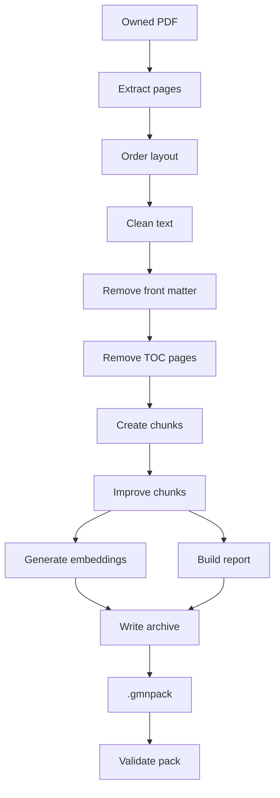
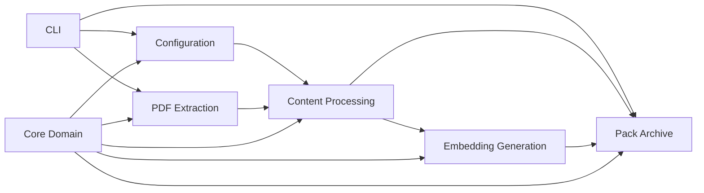

# PC Pack Builder

## Metadata

- File: `pack-builder/README.md`
- Created: 2026-08-10
- Last updated: 2026-08-10
- User: brackistar

Local CLI for converting user-owned PDFs into `.gmnpack` archives that the Android app can import.

Generated packs and source PDFs are private local artifacts. Do not commit commercial PDFs, extracted sourcebook text, or generated commercial packs.

## Commands

From this directory:

```bash
uv run pack-builder build --system "Example System" --edition "1e" --title "Example Book" --out example.gmnpack book.pdf
uv run pack-builder inspect example.gmnpack
uv run pack-builder validate example.gmnpack
uv run --extra dev pytest
```

The default build path uses `sentence-transformers/all-MiniLM-L6-v2` and writes 384-dimensional embeddings. Tests use a deterministic local embedding provider so they do not need internet access or model files.

## Build Controls

Useful build options:

```bash
uv run pack-builder build --force --max-chars-per-chunk 1200 --report-out report.json --verbose --system "Example System" --edition "1e" --title "Example Book" --out example.gmnpack book.pdf
uv run pack-builder build --extractor pymupdf-layout --force --system "Example System" --edition "1e" --title "Example Book" --out example.gmnpack book.pdf
uv run pack-builder build --chunk-overlap-chars 200 --keep-toc-pages --no-clean-text --no-deduplicate-chunks --system "Example System" --edition "1e" --title "Example Book" --out example.gmnpack book.pdf
uv run pack-builder build --dry-run --report-out report.json --system "Example System" --edition "1e" --title "Example Book" --out example.gmnpack book.pdf
uv run pack-builder build --config build-config.json
uv run pack-builder report example.gmnpack
uv run pack-builder compare-extractors book.pdf
uv run pack-builder schema --json
uv run pack-builder sample-chunks --limit 5 example.gmnpack
uv run pack-builder page-chunks --page 12 example.gmnpack
uv run pack-builder inspect --json example.gmnpack
uv run pack-builder validate --json example.gmnpack
```

- `--force` overwrites an existing output pack.
- `--dry-run` extracts and chunks without generating embeddings or writing a pack.
- `--extractor pymupdf-layout` uses block ordering tuned for multi-column RPG manuals.
- `--max-chars-per-chunk` controls retrieval chunk size.
- `--chunk-overlap-chars` prepends trailing context from the previous chunk.
- `--clean-text/--no-clean-text` toggles repeated-line removal, word repair, table-line preservation, and hyphen repair.
- `--remove-front-matter/--keep-front-matter` toggles early credits/legal cleanup.
- `--front-matter-max-page` limits front-matter cleanup to early book pages.
- `--remove-toc-pages/--keep-toc-pages` toggles early table-of-contents cleanup.
- `--toc-max-page` limits TOC cleanup to early book pages.
- `--deduplicate-chunks/--no-deduplicate-chunks` toggles duplicate chunk removal.
- `--report-out` writes the extraction quality report as standalone JSON.
- `--verbose` prints empty, suspicious, duplicate, and warning counts.
- `--json` makes `inspect` and `validate` machine-readable.
- `--config` reads repeatable build settings from a JSON file.

Example `build-config.json`:

```json
{
  "pdfs": ["C:/path/to/book.pdf"],
  "system": "Example System",
  "edition": "1e",
  "title": "Example Book",
  "out": "C:/path/to/example.gmnpack",
  "extractor": "pymupdf",
  "embedding_provider": "sentence-transformers",
  "embedding_model": "sentence-transformers/all-MiniLM-L6-v2",
  "max_chars_per_chunk": 1200,
  "chunk_overlap_chars": 200,
  "clean_text": true,
  "remove_front_matter": true,
  "front_matter_max_page": 3,
  "remove_toc_pages": true,
  "toc_max_page": 20,
  "deduplicate_chunks": true,
  "report_out": "C:/path/to/report.json"
}
```

CLI flags override config file values.

## Quality Inspection

- `report` prints extraction quality metrics from `extraction-report.json`.
- `report --json` prints the full report.
- `report` prints warning counts, page references, and build timings.
- `sample-chunks` prints a few chunk text samples for manual review.
- `sample-chunks --contains "term"` filters sampled chunks by text.
- `page-chunks --page <n>` prints chunks that cite a specific PDF page.
- `compare-extractors` compares PyMuPDF, PyMuPDF layout, and pdfplumber page character counts.
- `schema` prints the current `.gmnpack` contract.



## Archive Layout

Each `.gmnpack` is a ZIP archive containing:

- `manifest.json`
- `documents.json`
- `chunks.jsonl`
- `embeddings.npy`
- `extraction-report.json`

The extraction report records chunking settings, cleanup actions, front-matter cleanup actions, TOC cleanup actions, chunk quality actions, build timings, per-page text lengths, empty pages, suspiciously short pages, duplicate normalized page text, warnings, and errors.

The manifest records build options such as extractor, chunk size, overlap, cleanup flags, and deduplication. This makes packs easier to reproduce and compare.

Advanced extraction diagnostics flag likely OCR-needed pages, table-shaped text, multi-column-shaped text, and merged-word artifacts. Password-protected PDF handling is intentionally out of scope.

OCR support is detection-only. The report separates image-only OCR candidates, truly blank pages, and low-text image pages so scanned material can be reviewed without treating every art page as missing text.

For RPG manuals with heavy columns or tables, compare extraction first:

```bash
uv run pack-builder compare-extractors book.pdf
uv run pack-builder build --extractor pymupdf-layout --dry-run --report-out report.json --system "Example System" --edition "1e" --title "Example Book" --out example.gmnpack book.pdf
```

Blank pages and image-only pages are reported separately. In RPG manuals, empty pages are often covers, chapter openers, divider art, or blank end pages. Treat them as extraction failures only when neighboring page lengths, sample chunks, or the source PDF show that rule text is missing.

## Internal Structure

- `cli.py` owns Typer commands and user-facing output.
- `configuration/` resolves JSON config files and CLI overrides.
- `core_domain/` contains shared constants and sourcebook pack data models.
- `pdf_extraction/` owns extractor adapters, layout ordering, diagnostics, and comparisons.
- `content_processing/` coordinates text cleanup, TOC removal, chunking, and chunk quality.
- `embedding_generation/` owns embedding provider adapters.
- `pack_archive/` reads, writes, reports on, validates, and describes `.gmnpack` archives.


